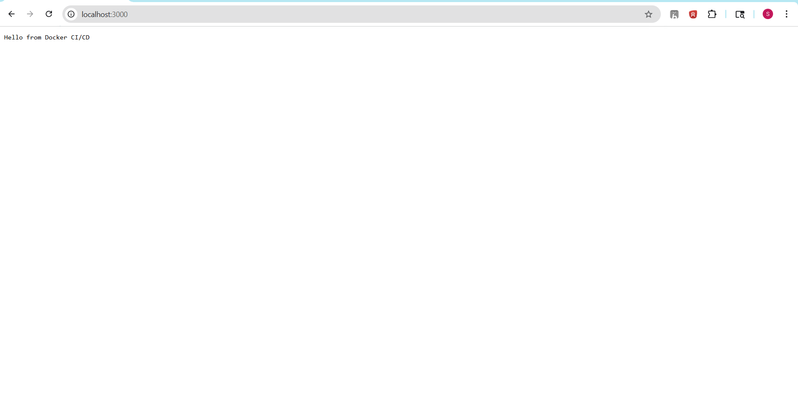
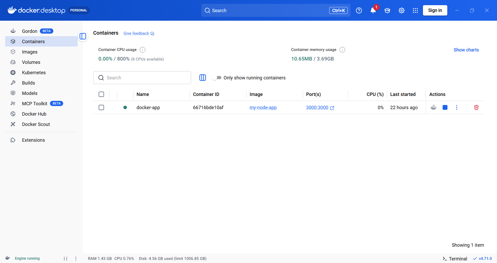
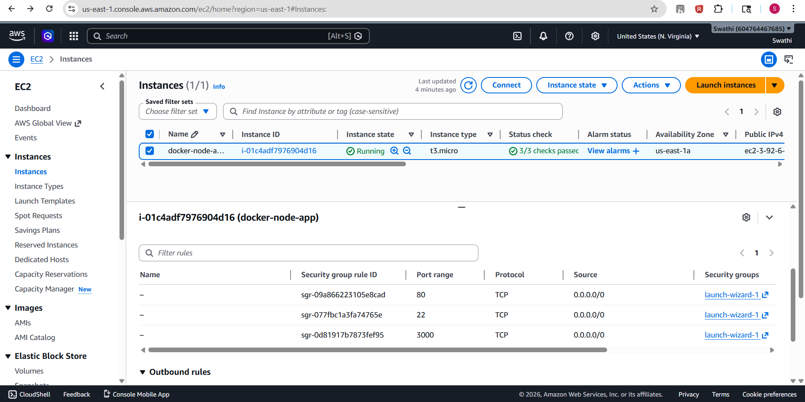
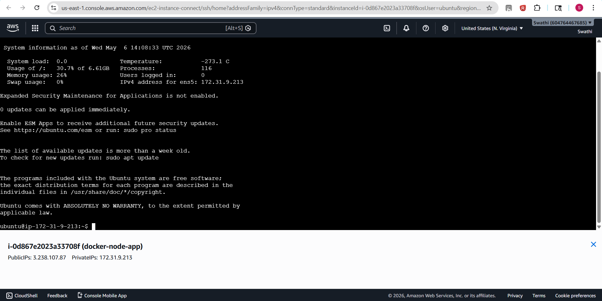
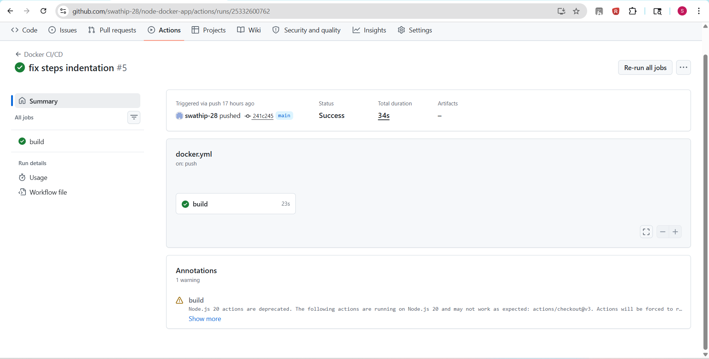
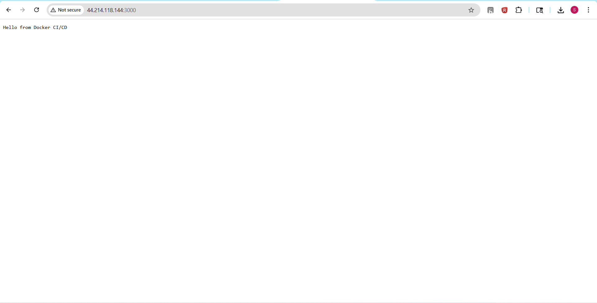

# Dockerized Node.js Application with CI/CD on AWS EC2

## Project Overview

This project demonstrates the deployment of a Dockerized Node.js web application on AWS EC2 using a CI/CD pipeline with GitHub Actions.

The application is containerized using Docker, hosted on an Ubuntu EC2 instance, and automated using GitHub Actions for continuous integration.

## Project Screenshots
### Local Docker Application
Running the app locally in Docker at localhost.



---

### Docker Container Running
Docker Desktop showing the running container and port mapping configuration.



---

### AWS EC2 Instance
AWS EC2 instance configured and running for application deployment.



---

### EC2 Terminal Access
Connected to the EC2 Ubuntu instance using EC2 Instance Connect terminal.



---

### GitHub Actions CI/CD Pipeline
Successful execution of the CI/CD workflow using GitHub Actions.



---

### Live Application on AWS EC2
App is live and accessible via the EC2 public IP.



## Technologies Used

* Node.js
* Express.js
* Docker
* Git & GitHub
* GitHub Actions
* AWS EC2
* Ubuntu Linux

## Features

* Dockerized Node.js web application
* CI/CD pipeline using GitHub Actions
* AWS EC2 deployment on Ubuntu server
* Docker container management
* Publicly accessible application
* Automated build workflow
* Linux server configuration and setup

## Docker Commands Used

### Build Docker Image

```bash
docker build -t my-node-app .
```

### Run Docker Container

```bash
docker run -d -p 3000:3000 my-node-app
```

### Check Running Containers

```bash
docker ps
```

---

##  Steps for AWS EC2 Deployment

1. Start an Ubuntu EC2 instance
2. Set Up Security Groups

   * Port 22 (SSH)
   * Port 3000 (Application)
3. Connect using SSH
4. Install Docker & Git
5. Clone GitHub repository
6. Construct Docker image
7. Run Docker container

---

##  GitHub Actions CI/CD

The project uses GitHub Actions workflow for:

* Code checkout
* Build a docker image
* Deployment workflow setup

Workflow file location:

```bash
.github/workflows/docker.yml
```

---

## Application Access

Application runs on:

```bash
http://<EC2-PUBLIC-IP>:3000
```

---

---

## Learning Outcome

* Docker containerization
* CI/CD pipeline basics
* AWS EC2 deployment
* Linux command-line operations
* GitHub Actions workflows
* Docker container management

## Future Enhancements

* Automatic deployment to EC2 after every GitHub push
* Docker Hub image integration
* Nginx reverse proxy configuration
* HTTPS/SSL implementation
* Monitoring using Prometheus and Grafana
* Kubernetes deployment support

---

## Author
Swathi P

Cloud Engineer
